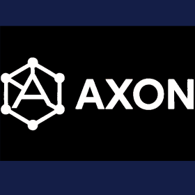
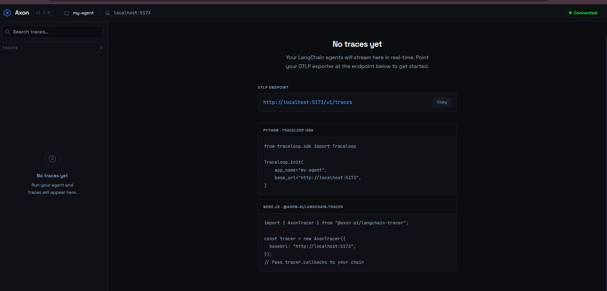
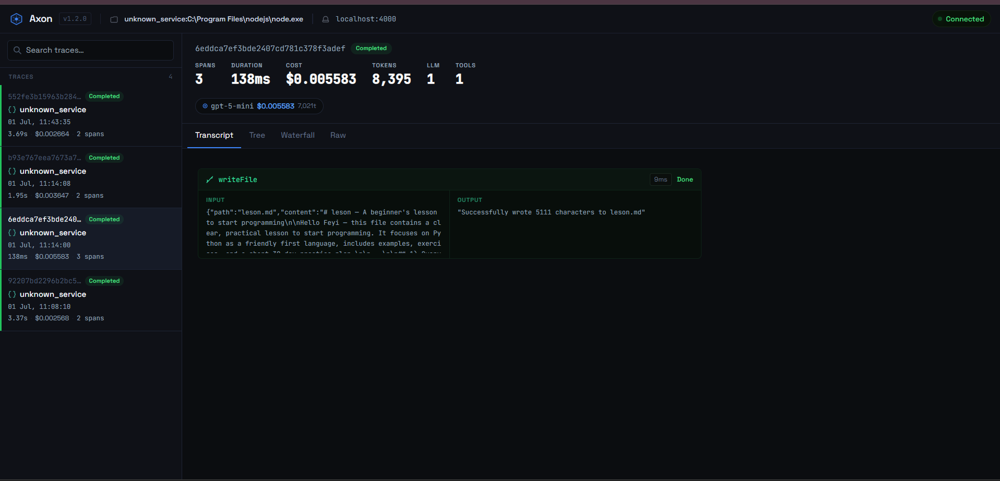
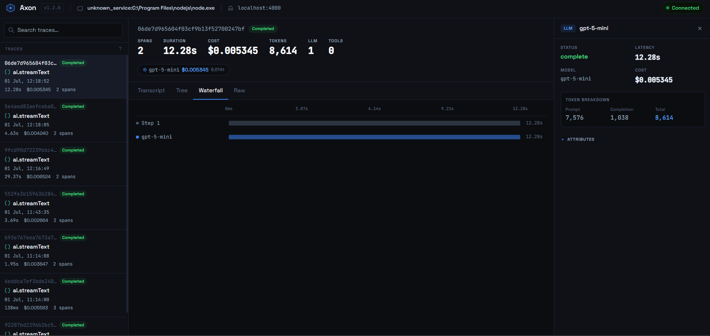
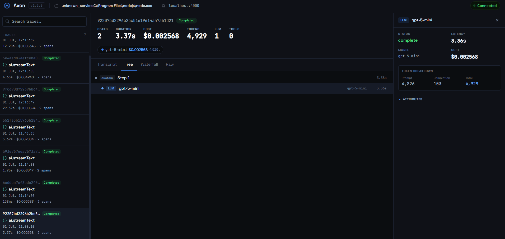
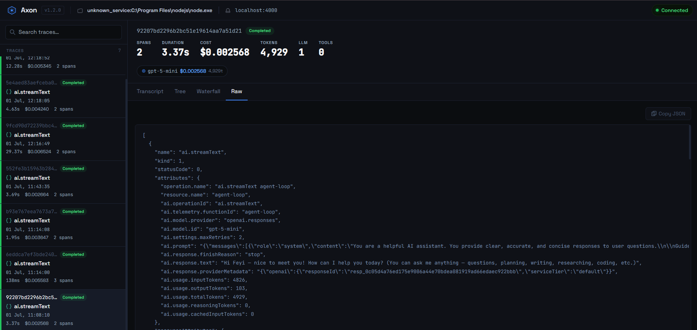

# Axon

<p align="center">
  
</p>

Axon is a local observability tool for LangChain and OpenTelemetry-instrumented AI agents. It receives trace data from your application, stores it on your machine, and gives you a real-time dashboard to monitor and debug every LLM call, tool invocation, and chain execution. No cloud account is required and no data leaves your environment.

---

### Features

**Overview - shows your OTLP endpoint and integration snippets the moment Axon starts**


### Trace Views

**Transcript — renders the run as a conversation with tool call inputs and outputs inline**


**Waterfall — each span as a horizontal bar on a shared time axis with a detail panel**


**Tree — parent-child span hierarchy with type icons, model names, and token counts**


**Raw — full JSON of every span with a copy button**


---

## How it works

Axon runs entirely on your machine. When you start it, a single server comes up that handles two responsibilities: it accepts incoming OTLP trace data from your application, and it serves the dashboard that visualises those traces. The server writes all trace data to a local SQLite database scoped to your project directory. The dashboard connects to the server over WebSocket so new spans appear in real time as your agent runs.

The tool is distributed as three packages that work together. `@axon-ai/cli` is the command-line interface you interact with. `@axon-ai/backend` is the Express server and database layer. `@axon-ai/dashboard` is the React web interface. When you install the CLI, it bundles the other two so you only need one install.

---

## Getting started

**Prerequisites**

- Node.js 18 or higher
- A LangChain or OpenTelemetry-instrumented application running in development

**Install the CLI**

```bash
npm install -g @axon-ai/cli
```

**Initialise your project**

Run this inside your project directory. It creates a `.axon-ai/` folder that holds your configuration and local trace database.

```bash
axon-ai init --project my-app
```

**Start Axon**

```bash
axon-ai start
```

This launches the backend server and opens the dashboard in your browser. By default the server runs on port 4000. The OTLP ingest endpoint is available at `http://localhost:4000/v1/traces`.

**Point your application at Axon**

For Node.js applications using `@axon-ai/langchain-tracer`:

```bash
npm install @axon-ai/langchain-tracer
```

```js
import { createAutoTracer } from '@axon-ai/langchain-tracer';
createAutoTracer({ endpoint: 'http://localhost:4000' });
```

For Python applications using OpenLLMetry:

```bash
pip install traceloop-sdk
```

```python
from traceloop.sdk import Traceloop
Traceloop.init(
  app_name="my-agent",
  api_endpoint="http://localhost:4000",
)
```

Run your application and switch to the dashboard. Traces appear automatically as your agent executes.

---


## CLI reference

| Command | Description |
|---|---|
| `axon-ai init` | Initialise Axon in the current directory |
| `axon-ai start` | Start the backend and dashboard |
| `axon-ai status` | Check whether services are running |
| `axon-ai stop` | Stop all running services |
| `axon-ai version` | Show version information |

**Options for `axon-ai init`**

- `--project <name>` sets the project name used to group traces. Defaults to `default`.
- `--auto-start` launches the dashboard immediately after initialisation.

**Options for `axon-ai start`**

- `--port <number>` sets the port for both the server and dashboard. Defaults to `4000`.
- `--no-open` prevents the browser from opening automatically.
- `--project <name>` tags incoming traces with a project name.

---

## Configuration

`axon-ai init` creates a `.axon-ai/config.json` file in your project root. You can edit it directly.

```json
{
  "project": "my-app",
  "backend": {
    "port": 4000,
    "host": "localhost"
  }
}
```

Trace data is stored in `.axon-ai/traces.db`. This file is local to your machine and is not committed to source control. Add `.axon-ai/traces.db` to your `.gitignore` if you want to keep it out of your repository.

---

## Docker

If you prefer not to install Node.js, you can run the full stack with Docker Desktop.

```bash
make start      # start backend and dashboard
make stop       # stop all services
make logs       # stream logs from all containers
make restart    # restart services
make clean      # remove containers and volumes
```

The dashboard is available at `http://localhost:8080` and the OTLP endpoint at `http://localhost:3000/v1/traces`.

To reset the trace database:

```bash
make stop
docker volume rm axon_axon-data
make start
```

---

## Troubleshooting

**Port already in use**

Another process is using the default port. Pass a different port with `axon-ai start --port 5000`.

**Dashboard does not open**

Run `axon-ai status` to confirm the server started successfully. If it did, open `http://localhost:4000` manually in your browser.

**Traces are not appearing**

Confirm your application's OTLP exporter is pointing at the correct endpoint (`http://localhost:<port>/v1/traces`). Check the terminal where `axon-ai start` is running for any ingestion errors.

**Database issues**

If the database becomes corrupted, stop Axon, delete `.axon-ai/traces.db`, and restart. All historical traces will be lost but the service will recover cleanly.

---

## Contributing

Contributions are welcome from developers of all experience levels.

To get started, fork the repository. The project is a Node.js monorepo with three workspaces: `packages/cli`, `backend`, and `dashboard`. Install dependencies from the root with `npm install`. You can run the full stack in development mode with `npm run dev`, which starts the backend and dashboard in parallel with hot reload.

When making changes, run `npm test` to execute the test suite before submitting a pull request. Please keep pull requests focused on a single concern and include a clear description of what the change does and why.

---

## License

This project is licensed under the [MIT License](LICENSE).
